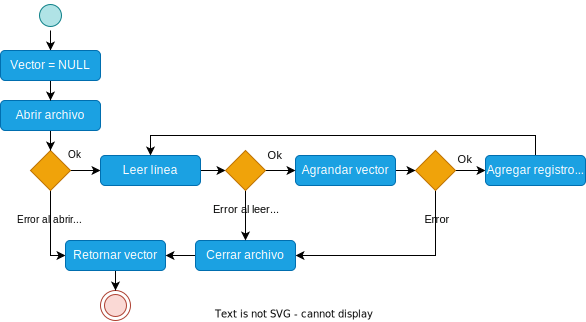

<div align="right">

</div>

# TP1

## Repositorio de Marlene Elizabeth Gimenez Gauto - 110506 - gimenezzeli@gmail.com

- Para compilar:

```bash
línea de compilación
```

- Para ejecutar:

```bash
línea de ejecución
```

- Para ejecutar con valgrind:
```bash
make valgrind-chanutron
```
---
##  Funcionamiento

Mi programa funciona primero abriendo el archivo que recibe por parametro y despues lo lee linea por linea. Con una funcion auxiliar llamada 'cantidad_delimitadores' puedo saber cuantos delimitadores hay en esa linea. Una vez que se cuantos delimitadores tiene la linea.
Si la linea tiene un delimitador, es decir es una linea de pokemon, intento guardarme esos datos (nombre, tipo); si el tipo que guarde en mi variable es valido lo cargo en mi pokemon_aux, que previamente habia guardado en memoria. 
Si la linea tiene dos delimitadores, es decir es una linea de ataque, intento guardarme esos datos en otra variable (nombre, tipo, poder); verifico que el tipo sea el correcto y lo guardo en mi pokemon_aux.
Una vez que ya tengo mi pokemon_aux cargado con Nombre, Tipo y tres ataques 


<div align="center">

</div>

En el archivo `sarasa.c` la función `funcion1` utiliza `realloc` para agrandar la zona de memoria utilizada para conquistar el mundo. El resultado de `realloc` lo guardo en una variable auxiliar para no perder el puntero original en caso de error:

```c
int *vector = realloc(vector_original, (n+1)*sizeof(int));

if(vector == NULL)
    return -1;
vector_original = vector;
```


<div align="center">

</div>

---
