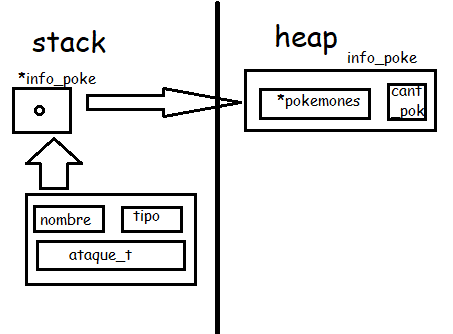

<div align="right">

</div>

# TP1

## Repositorio de Marlene Elizabeth Gimenez Gauto - 110506 - gimenezzeli@gmail.com

- Para compilar:

```bash
línea de compilación
```

- Para ejecutar:

```bash
línea de ejecución
```

- Para ejecutar con valgrind:
```bash
make valgrind-chanutron
```
---
##  Funcionamiento

Mi programa funciona primero abriendo el archivo que recibe por parametro y despues lo lee linea por linea. Con una funcion auxiliar llamada 'cantidad_delimitadores' puedo saber cuantos delimitadores hay en esa linea. Una vez que se cuantos delimitadores tiene la linea.
Si la linea tiene un delimitador, es decir es una linea de pokemon, intento guardarme esos datos (nombre, tipo); si el tipo que guarde en mi variable es valido lo cargo en mi pokemon_aux. 
Si la linea tiene dos delimitadores, es decir es una linea de ataque, intento guardarme esos datos en otra variable (nombre, tipo, poder); verifico que el tipo sea el correcto y lo guardo en mi pokemon_aux.
Una vez que ya tengo mi pokemon_aux cargado con Nombre, Tipo y tres ataques lo guardo en mi vector dinamico info previamente asignado con un malloc y lo agrando con un realloc cuando lo cargo exitosamente. Asi con todos los pokes.

En el archivo 'pokemon.c' la función 'pokemon_cargar_archivo' utiliza 'malloc' para agrandar la zona de memoria que va ser utilizada. Una vez verificado los datos, lo cargo a mi vector con la funcion 'cargar_poke_valido'. 
En la funcion 'cargar_poke_valido' utilizo un realloc para agrandar mi vector de pokes.

<div align="center">

</div>
--- 